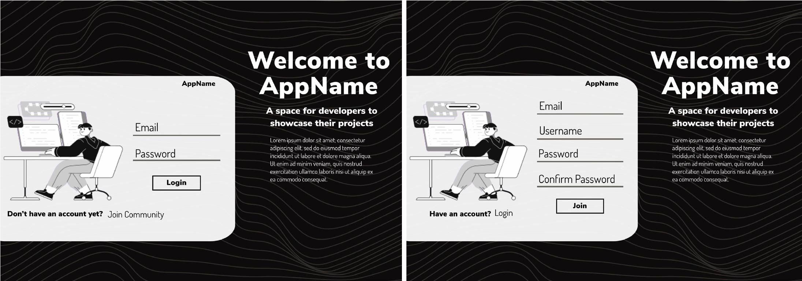
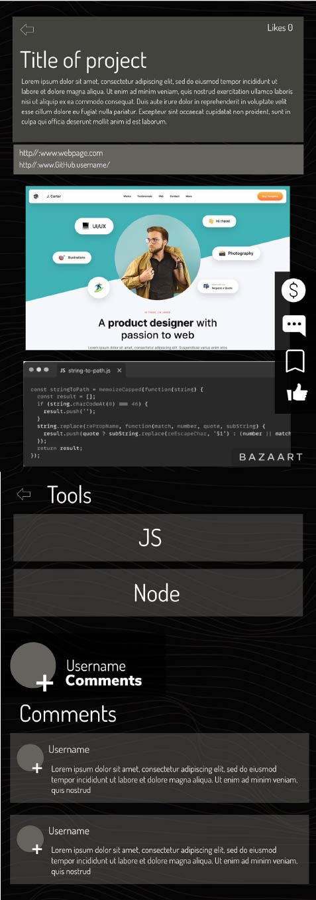
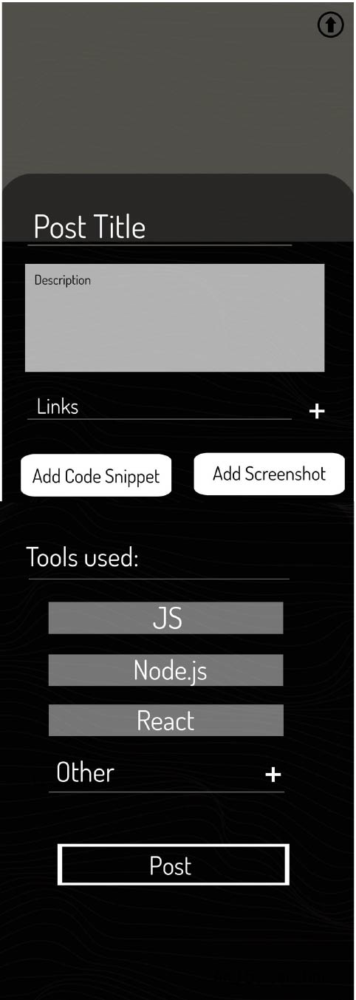

# Bootcamp MERN Capstone
## Deepen
*  A social platform for developers where they can showcase their projects, help and inspire. A GitHub repo/user search-engine with the UX of Pinterest and UI of Behance. Users upload their work, visuals, and live links or GitHub repo where the project can be found.

* Features:
  * Create, edit, delete and see posts.
  * Create, delete comments and likes.
  * Follow other users, see followers, created and saved projects.
  * Search for users or projects.
  * Create and edit user information.
  * Allows donations to developer or platform.
  * PWA
  
## Models:
  * User/Follower
  * Post/Like
  * Comment
  * Saved list
 
 ## Views:
 * Html: `landingpage/login, user profile, homepage(feed), single-post, create/edit post, followers/following list, search page.`
 * React: `user profile section display (about, work, liked posts, saved posts), image-view, interactive menu and user info` ...
 * JS: btns, ...
 * CS: Boostrap
 
 ## Controllers:
  * User: `create, edit, delete, getAll, get :id`
  * Post: `create, edit, delete, getAll, get :id` - Attached to User
  * Followers: `create, update` - Attached to User
  * Comment: `create, delete, getAll` - Attached to Post
  * Like: `create, update` - Attached to User and Post
  * Save List: `create, getAll, update` - Attached to User and Post
  
## API’s:
	* Google email for sign-up/login
	* Free images library for user: Post cover, User pic, and/or Profile hero. [Pexels maybe]
	* GraphQL
  
### Technologies:
- [HTML5](https://www.w3docs.com/learn-html/html5-introduction.html)
- [CSS3](https://www.w3schools.com/Css/)
- [JavaScript](https://www.javascript.com/learn/strings)
- [Node.js](https://nodejs.org/en/) [ES6](https://www.w3schools.com/Js/js_es6.asp)
- [Express](https://expressjs.com/en/guide/routing.html)
- [React](https://reactjs.org/docs/getting-started.html)
- [MongoDB](https://www.mongodb.com/docs/?_ga=2.103651840.1852606971.1667355129-2141532662.1666633665)
- [Mongoose](https://mongoosejs.com/)
- [GraphQL](https://graphql.org/)
- [Bcrypt](https://openbase.com/js/bcrypt/documentation)
- [webpage](https://webpack.js.org/guides/getting-started/#basic-setup)
- [IndexedDB](https://developer.mozilla.org/en-US/docs/Web/API/IndexedDB_API)
- [JWT](https://jwt.io/introduction) (Authentication)
- Payment Platform

#### Branches:
  * [main]
  	* skeleton and dependecies [protected]
  * [develop]
      * production enviroment
  * [feature/]
      * staging enviroment
_______________________________________
## **Brand**: 
### **Name**: 
Deepen - make more, intense, stronger, or more marked.
	* synonyms: intensify, heighten, expand, enhance, broaden.
	

### **Logo**: 


- Every user's contribution is part of something bigger.

## **Mock-up:**
# Homepage
   * Access to: login(email or username) password (auth), sign-up || (google login api)




# Feed
  * Access to: donation(platform), user profile, all projects, following projects, single post, follow/unfollow, user profile.


# Single Post
  * Access to: post cover, post title, post description, links, images/codes, tools list, comments, back to feed
      * menu: make donation to user, add comment, save project, like/unlike
      * user info: follow, comments, user profile.
    - both menu and user info stays on page and toggle view/hide



# User Profile
  * Access to: user info, created posts and post count, posts liked (optional) and overall-likes-received, followers, user cover, user pic
    * as user: create post, edit profile, saved posts
    * as viewer: make donation to user, follow, send email, 


# Create Post
  * Add: project cover(from lib api or upload), post title, description, links, list of predefined technologies or add new(saves to predefined), post




___________________________________________________
## Section to finish later !!
### Live View:
Heroku

## Installation
1. To install this application, `git clone` this repo.
2. Ensure Node.js is installed in your operating system `npm i node`.
3. Create a `.env` file in the root directory and include your MySQL username (DB_USER) and password (DB_PASSWORD) between the single quotes:
4. Install ***all*** of the npm packages listed above via command-line in terminal with `npm i -y`
5. Initialize MySQL by running `mysql -u root -p`, and enter your password when prompted. Once loaded, enter `SOURCE db/schema.sql;` to create the database. Exit MySQL by entering `quit;` in terminal.
6. The application can be accessed by visiting `http://localhost:3001` in the browser after running the following command:
```
`npm start` or
`node server.js`
```
7. [Insomnia](https://insomnia.rest/) or [Postman](https://www.postman.com/) can be used to check the backend functionality.

_____________________________________________________________________________________________
## Learning Curve
* While creating this app I learned and practice:
1. To use proper code organization paradigms in a full-stack app, following the MVC paradigm to organize your code into Models, Views, and Controllers.
2. Used Handlebar.js a template engine to deliver front-end files along expressions and helpers.
3. Used Express.js and Sequelize to implement sessions. Restrict routes to only logged in users and write custom middleware for Express.js, while using Sequelize to manage SQL data.
4. Managed front-end JavaScript logic in an MVC app to make fetch requests on the front end.
5. Used an ORM (Object-Relational-Mapping) to translate the object model into a relational data model using associations.
6. Create all of the server endpoints using RESTful API standards to work with model’s data and execute CRUD 
7. Create a login route for authentication. Use environment variables to protect sensitive data while securing user passwords stored in a database with hashing.

## Questions?
For any questions about this repo, please contact me at [nashalysf@gmail.com](mailto:nashalysf@gmail.com).

To view more of my works, please visit my GitHub: [nashalysf](https://github.com/nashalysf).

