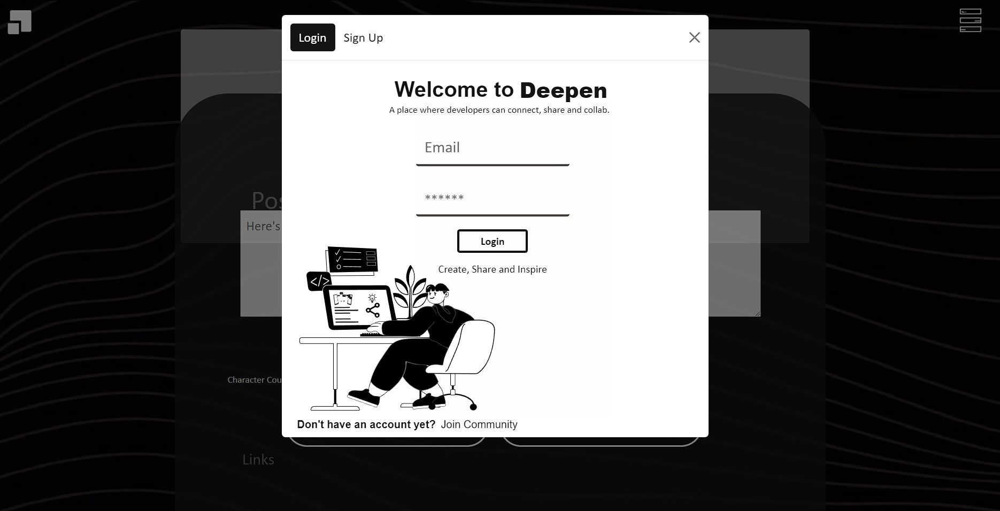

# Bootcamp MERN Capstone
## Deepen
*  A social platform for developers where they can showcase their projects, help and inspire. A GitHub repo/user search-engine with the UX of Pinterest and UI of Behance. Users upload their work, visuals, and live links or GitHub repo where the project can be found.
  
  ## **Brand**: 
### **Name**: 
Deepen - make more, intense, stronger, or more marked.
* synonyms: intensify, heighten, expand, enhance, broaden.
	

### **Logo**: 


- Every user's contribution is part of something bigger.

## Live View:
[Heroku](https://tranquil-forest-43343.herokuapp.com/home)



## Technologies:
- [HTML5](https://www.w3docs.com/learn-html/html5-introduction.html)
- [CSS3](https://www.w3schools.com/Css/)
- [JavaScript](https://www.javascript.com/learn/strings)
- [Node.js](https://nodejs.org/en/) [ES6](https://www.w3schools.com/Js/js_es6.asp)
- [Express](https://expressjs.com/en/guide/routing.html)
- [React](https://reactjs.org/docs/getting-started.html)
- [MongoDB](https://www.mongodb.com/docs/?_ga=2.103651840.1852606971.1667355129-2141532662.1666633665)
- [Mongoose](https://mongoosejs.com/)
- [GraphQL](https://graphql.org/)
- [Bcrypt](https://openbase.com/js/bcrypt/documentation)
- [webpage](https://webpack.js.org/guides/getting-started/#basic-setup)
- [IndexedDB](https://developer.mozilla.org/en-US/docs/Web/API/IndexedDB_API)
- [JWT](https://jwt.io/introduction)
- Payment Platform


## Installation
1. To install this application, `git clone` this repo.
2. Install ***all*** of the npm packages listed above via command-line in terminal with `npm i -y`
3. Create a `.env` file in the root directory and include your JTW token
4. The application can be accessed by visiting `http://localhost:3000` in the browser after running the following command:
```
`npm start` or
`node server.js`
```
5. [Apollo GraphQL](https://studio.apollographql.com/sandbox/explorer) can be used to check the backend functionality.

_____________________________________________________________________________________________
## Learning Curve
* While creating this app I learned and practice:
1. Integrated the Apollo Server GraphQL library to handle data requests to our API and built both query type definitions and resolvers for retrieving data and handle updates from a MongoDB database.
2. Signed and verified JWTs as part of the authentication process.
3. Implemented the tools to manage the full-stack MERN application for both production and development environments.
4. Organized and laid out the client-side React application files and used the Apollo Client library to consume the GraphQL API.
5. Used `Routes` and `Route` components to set up client-side routing and used URL parameters in React Router for dynamic page content.
6. Added variables to a useQuery Hook to run queries with arguments. 
7. Set up front-end functionality to create and log in a user using mutations with front-end authentication service to help manage a user’s logged-in status and user’s data on pages.

## Contributing
Contributions are welcome! Please contact me for more information.

## Tests
No tests are available at the moment. Feel free to contribute if you'd like to add testing.

## Questions?
For any questions about this repo, please contact me at [naferi.zoe@gmail.com](mailto:naferi.zoe@gmail.com).

To view more of my works, please visit my GitHub: [nashalysf](https://github.com/nashalysf).

